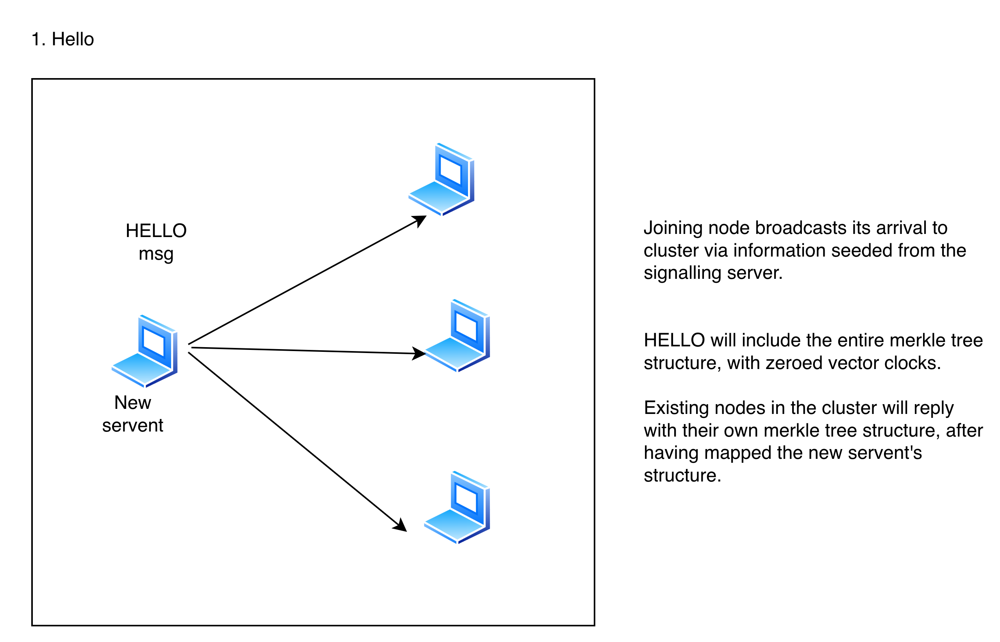
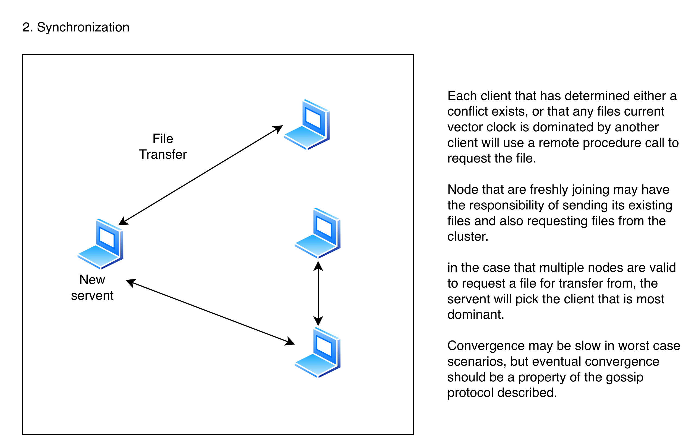

# PSync 

## Problem Context

Syncing files between devices is a task that typically involves some form of cloud storage, meaning less control and security of one's data. The experience of software designed around this premise (Dropbox, Google Drive, iCloud) is not ideal for the average user experience because:

i) Cloud storage requires many user interactions in order to transfer files between devices. The typical flow might look uploading a zip file and downloading it. Version control systems that are based off branches or diffs (like git or phabricator) aren't friendly to non-developers.

ii) Even for developers, it doesn't truly satisfy the flow of having some obsidian workspace or pdfs and being able to access them on any other device as if it were native. There needs to be a way to designate that this directory and all nested files should be synchronized.

*\*note I do concede that SyncThing solves this exact problem, and is cross platform. HOWEVER the main personal goal of this project is just to learn and build something for my specific use case (near real-time sync for obsidian).*

___
## Proposed Solution

The proposed implementation takes a peer-to-peer approach to implementing a (continuous) distributed file system. There are three main software components.

1. **Signalling Server**
As follows with WebRTC (which will probably be used for networking and communication in this project), a signalling server is required to help nodes (peers/servents?) both advertise and also locate each other. This will likely include data like a node's IP address, and some form of authentication would be required to identify which nodes actually belong in a cluster. This will probably use some sort of public key infrastructure, but I haven't entirely worked this out yet.

Regarding WebRTC, the server will act as more of a relay to help disjoint peers relay the session description protocol (SDP). The server will have a modifier Offer/Answer/Candidate protocol, since clients should be able to make requests/offers to peer with all known members in its group.

2. **Daemon**
A daemon should be able to configured and run via a TUI to designate specific directories as the root of a file system that should be synchronized. The daemon will watch for system calls applied to the directory and broadcast them to the peers it is synchronizing with. It should also be able to receive messages from other daemon's (via true peer to peer communication) and automatically make merges or download files. The daemon also needs to be able to handle conflicts. This will likely be done with copies and marking one copy as conflicted.

3. **Relay Storage** (stretch)
Somewhat related to the daemon, but a relay storage cloud database will help solve one key problem for any P2P system: what happens when all nodes go offline? We could say that we only allow synchronization if there's at least one peer online, but we can take a snapshot and store the encrypted data in a database, or maybe just a big S3 object. When a peer comes back online, it can invalidate the snapshot and delete it from temporary storage.

4. **User Interface**
While earlier milestones will simply use a TUI to make room for the core development of the feature, there are some core workflows for ease of use. Users need to be able to select which directories should be considered root nodes to synchronize. There may also need to be some default path designation for where files should be synchronized. Perhaps for sake of timeline, all files under a specific path will be synchronized.
___
## Goals and Non-Goals
*Maybe somewhat stolen and heavily inspired by SyncThing's Goals!*

### 1. Data Consistency - Preventing Loss

Ensuring that files maintain valid is fairly key to this project being viable at all, as if there was a chance they could become corrupted, there would be no point in using FSync at all. This does mean that in decisions where this might be considered a "tradeoff" it is prioritized by default.

### 2. Automatic

Besides being functional, the only reason I'm building this is because I don't want to manually transfer files. Users won't be notified of conflicting files, but there will be reasonable handling (like a copy flagged file)

> Changes to files are received without prompting. Conflicts are handled without input.

### ~~**3. Secure-ish...**~~

This project is mainly focused on the peering aspect of design, and I'm no expert with encryption! However, precautions will be taken with the signalling servers to ensure MITM and other common attacks should be prevented with some public key exchange that works for multiple peers (or perhaps for a specific connection).

## Non-Goals

- Not trying to be universally usable (or even viable for other use cases beyond my note taking). This project is primarily and predominantly for learning

- This project is also not taking into account network topology that would be otherwise incredibly important for distributed file systems that scale. Peer to peer systems are taxing on a network and typically result in a thoughtful communication protocol, or custom routing for virtual networks (à la DropBox).

- Building a robust signalling server. While I do mean to build it robustly to function for my intents and purposes, I'm not building the server to work across all AS's. Parts of the WebRTC RFC like dealing with NAT'd networks are things that I won't be building at the moment.

___
# Design

**Signalling Server**

[diagram link](https://app.diagrams.net/#G1LEJ18QLKvRRkrtkHT3kJEX93hUJQu4td#{%22pageId%22%3A%226VG0eJYwPst5x-o_TJWJ%22})

The signalling server has a couple of core goals. First and foremost, authentication and security. We don't want random people being able to access our group and as such we'll want to ensure only authenticated users can view the list of peers for their specific group (and they'll need to prove it to each peer as well). Public/private key pairs are fine for one communication channel, but don't provide the authentication necessary, unless a user manually configures an allow list of public keys (which isn't ideal!). Really we want to consolidate a user's identity, and as such a central identity provider is ideal.

**Daemon**

The Daemon will be a necessity for implementing the requirements of PSync (i.e. some bidirectional version of rsync) with some debounce interval for tracking FSnotify events and asynchronous networking I/O. The algorithm for a file sync is described as follows:

**File Exchange Protocol**:
*the protocol assumes that peers have already been seeded with adequate information to communicate to other peers through WebRTC*

Context: the daemon will be running from a specific directory, which will be treated as the root of the files that it intends to sync. For our case, this will be the "~/Documents/Obsidian\ Vault/" but users need to be prompted to confirm as to avoid unintentional collisions and mirroring.

1. Initialization

Upon the startup of the daemon, a node will walk its files (directories, and files) with a level order traversal. In a full implementation, a fixed size block (perhaps 64 bytes) will have a hash computed. The daemon will keep track of a version vector with a length of the number of peers in it's system, all initialized to zero. This list will be a component of the initialization message. The initial implementation will likely be computed based on an entire file, although the hash will need to be of variable length.

The joining node will broadcast that it is joining the cluster, with a versioning number 0. Other nodes in the cluster will transmit their list of information to the joining node (similar to what we have described above).

> Note that replies will be sent with some random delay to prevent broadcast swarming\*

There may be more data about tombstones that are also transmitted. The daemon is now ready to synchronize.

2. Synchronization

Upon receiving this information, The daemon will concurrently populate metadata about versioning and identify files that are not identical or missing and request the files to be sent from a peer with the information available.

> A merkle tree structure can be used to determine which directories/files require directories (via backtracking, recursion can terminate early when hashes match).

This should be heavily pipelined or done asynchronously (perhaps using a non blocking form of go's coroutines, as no inter-thread communication is required). This will continue until the daemon no longer has work to do, and it will enter into the third state.

The procedure each thread should accomplish is as follows:
- determine which peer currently dominates (via vector clock ordering) or randomly select one that is tied in concurrent updating state.

> Conflicts (where no clock dominates the other) will be deterministically resolved via the client's ID (alphabetical ordinance). Conflicting files will have a "(conflict)" appended - an extremely simple approach to resolving two way conflicts. For larger clusters, verifiable correctness is important for file synchronization! Having a "(conflict)" append loop would not be ideal

- once the peer has accomplished synchronization it sends an acknowledgement with it's state vector. If it once again determines it is unsynchronized (due to the other peers synchronizing) it will restart this process
- once the file is in a "stable" state, the coroutine may be freed

> Larger files will have their own coroutine to stream larger files, such that WebRTC is able to support the transfer of files larger than 10 MB. WebRTC is based on STCP, which already chunks by sizes of 16 KiB (16 * (2 ^ 10) bytes) for reliable transfer, but synchronously transferring large files may be preferable to avoid overloading the network.

3. Updating

i) Heart Beats

- regular pings are sent with some fixed length checksum to verify that eventual consistency is still in place - if not we reenter the procedure described in synchronization.
- if no response is heard, the peer should be marked as inactive. Updating metadata here is likely the most difficult component
- tombstones are schedule to be cleaned on a basis of every 2-3 days: shorter periods may cause desync issues, 2-3 is most conservative

> Via this gossip strategy, the graph creates a mesh topology where all nodes know each other. For larger systems, a spanning tree is preferable for the network. However, the daemon will send its heartbeats to the signalling server for some specific user's domain. This approach offloads some of the work to the central server, but also avoids worst case scenarios where a cluster somehow becomes partitioned for a long duration, creating massive diffs/conflicts.

ii) Pushes

- upon FSNotify events (which should be read with a 100 ms debounce) while the daemon is in passive mode, the daemon will firstly:
	- update metadata regarding the file, increment the counter for the block, and then its vector clock for the file (in the first implementation we only have the vector clock for the file)
	- it then broadcasts this information to other clients, including the path of the updated file, and the changes
	- the receiver then adjusts accordingly, and sends an acknowledgement to the sender
		- there should be an acknowledgement for receiving the update, and that it successfully processed the update,

**Relay Storage**
- likely to be combined as a component of the relay server itself, and a stretch goal for the current state

**TUI/GUI**
Here are the truly "functional" requirements for the project: the interface. Users should be able to run the daemon from the terminal with a given set of argument or with some inferred defaults. This includes the following:

- the "root" of the file system to be mirrored
- parameterizing the debounce for push events (default 100 ms)
- network throttling (... not sure what the correct default rate is at the moment)

(stretch)
- trusted vs safe mode
	- i.e. trusted devices will have full bidirectional mirroring in the cluster, nodes that are in safe mode are read only, and will not apply changes from the cluster, essentially creating a broadcast rsync protocol. This would be challenging and requires changes to the architecture.

___
# Alternatives Considered

What were the other solutions you considered? Why weren’t they chosen? Useful for discussion but also to serve as documentation so these alternatives aren’t considered again.

- considered using CRDT's for conflict resolution and real time collaborative editing. It's a fairly separate domain, and also distinguishing between what should be a file to be updated or a live edit (and maintaining other state) would be an entire project on its own
- just using git for a simple diff engine and pushing and pulling. This is centralized and honestly fine for most people that use obsidian or want to sync that are a bit more technical.... However it doesn't fulfill my primary goal of learning, and also means that your data is not private. Ironically, this project might end up using Git's diff engine, or I might write my own!
- Automatic conflict resolution. While it's probably an interesting problem to look at the UX for conflict resolution, it distracts from the core of the project. If something can be automatically resolved it will be. Otherwise it will create a copy of the conflicting file, with some deterministic ordering so peers can agree (also similar to DropBox).
- Rsync? PDTP? SFTP? Gnuttella? Bittorrent? The issue with these application layer protocols (or applications) is mainly that their intended usecase is different. Gnuttella and Bittorrent are truely peer to peer but also lack

___
# Open Questions

What is the correct level of consistency? How "eventual" is eventual?

What happens with write conflicts? Who should win?

How do we mitigate some of the risks of coupling file systems?

___
# Timeline and Milestones

Add high-level timelines and key milestones for tracking project execution.

| Phase | Description | Deadline |
|-------|-------------|----------|
| Design | Architecture | Fri Dec 26 |
| Signal-Server | Scaffolding and types | Sat Dec 27 |
| Signal-Server | Test harness | Sun Dec 28 |
| Signal-Server | Core implementation | Wed Dec 31 |
| Daemon | Scaffold and types | Thu Jan 1 |
| Daemon | Test harness | Fri Jan 2 |
| Daemon | Simple synchronization implementation | Sun Jan 4 |
| Daemon (Stretch) | Streaming large file transfers | TBD |
| Daemon (Stretch) | Block-based exchange | TBD |
| (Stretch) | Relay storage | TBD |
| Blog / Twitter | Write and publish project summary | Sat Jan 10 |
