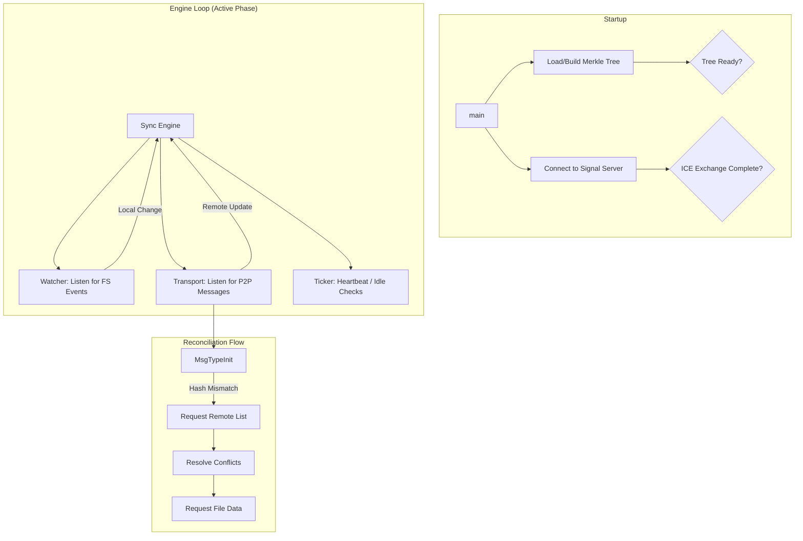

# PSync Daemon

File synchronization daemon for peer-to-peer file sync over WebRTC. It orchestrates filesystem monitoring, state management, and P2P communication to keep directories in sync without a central server.

---

## Architecture Overview

PSync follows a modular architecture where each component has a distinct responsibility:

### 1. Transport Module (`/transport`)

Manages all peer-to-peer communication using **WebRTC DataChannels** and a central WebSocket-based signaling server.

#### WebRTC Connection Establishment

**Signaling Protocol:**
1. Daemon connects to signal server via WebSocket (`ws://localhost:8080/ws`)
2. Sends `SignalRegister` message with `PeerID` and `GroupID`
3. Signal server responds with `SignalPeerList` containing all existing peers in the group
4. Signal server broadcasts `SignalPeerJoined` to existing peers when a new peer registers

**Connection Initiation (Unidirectional):**
- **Joining peer** (new arrival) initiates WebRTC offers to all existing peers
- **Existing peers** receive `SignalPeerJoined` and passively wait for incoming `SignalOffer`
- This prevents double-connection races where both peers try to connect simultaneously

**Step-by-Step Handshake:**
1. **Peer A** (new) receives `SignalPeerList: [B, C]`
2. **Peer A** calls `initiateConnection(B)`:
   - Creates `PeerConnection` with STUN servers
   - Creates DataChannel named `"sync"` (SCTP-based, reliable ordered delivery)
   - Generates SDP Offer
   - Sends `SignalOffer` to **Peer B** via signal server
3. **Peer B** receives `SignalOffer` from **Peer A**:
   - Creates `PeerConnection` with remote SDP
   - Sets up `OnDataChannel` handler (receives the `"sync"` channel from A)
   - Generates SDP Answer
   - Sends `SignalAnswer` to **Peer A**
4. **ICE Trickle** (both sides):
   - `OnICECandidate` fires as local candidates are discovered
   - Each candidate is sent via `SignalCandidate` to the remote peer
   - Remote peer calls `AddICECandidate` for each received candidate
5. **Connection Established**:
   - DataChannel transitions to `Open` state
   - `OnPeerConnected` callback fires on both sides
   - Sync Engine's `handlePeerConnected` sends initial `MsgTypeInit`

**Thread Safety:**
- All signaling WebSocket writes are protected by `wsMu` mutex to prevent concurrent write panics
- Peer map (`peers`) is protected by `peersMu` RWMutex
- DataChannel sends do not require additional locking (Pion WebRTC handles internal synchronization)

---

### 2. Sync Engine (`/sync`)

The orchestrator that integrates transport, watcher, merkle, and state management into a coherent sync protocol.

#### Initialization & State Loading

**Startup Sequence:**
1. Load persisted state from `.psync/metadata.json` (if exists)
2. Initialize `Resolver` with local `PeerID` for tie-breaking
3. Build initial Merkle tree (ignoring `.psync` directory)
4. Register transport callbacks: `OnMessage`, `OnPeerConnected`, `OnPeerDisconnected`
5. Launch `processEvents` goroutine to handle watcher events and heartbeats

#### Reconciliation Protocol (Detailed Message Flow)

**Scenario: Peer B joins, Peer A has file `doc.txt`**

```
1. WebRTC DataChannel Opens
   ├─ A: OnPeerConnected(B) → Send MsgTypeInit{Hash: merkle_A}
   └─ B: OnPeerConnected(A) → Send MsgTypeInit{Hash: merkle_B}

2. Hash Comparison
   ├─ A receives Init from B: merkle_A == merkle_B? → Yes: No action
   └─ B receives Init from A: merkle_B == merkle_A? → No: Mismatch!

3. B initiates reconciliation:
   B → A: MsgTypeGetFileList (empty payload)

4. A responds with full state:
   A → B: MsgTypeFileList{
       Files: [
           {Path: "doc.txt", Hash: "abc123", Version: {A: 5}, Tombstone: false}
       ]
   }

5. B processes FileList:
   For each remote file:
       - If !exists locally && !tombstone → Request file
       - If exists locally → Compare via Resolver

   B's decision: "doc.txt" is new → Request it
   B → A: MsgTypeFileRequest{Paths: ["doc.txt"]}

6. A serves requested files:
   For each path:
       - Verify file exists in state (not tombstone)
       - Read file content from disk
       A → B: MsgTypeFileData{
           Path: "doc.txt",
           Content: <binary data>,
           Version: {A: 5}
       }

7. B applies received file:
   - Create directories if needed: os.MkdirAll(filepath.Dir(fullPath))
   - Write to temporary file: "doc.txt.tmp"
   - Atomic rename: os.Rename("doc.txt.tmp", "doc.txt")
   - Watcher detects new file → Triggers local event processing

8. B processes local event (from write):
   - Rebuild Merkle tree (now includes "doc.txt")
   - Update FileState: Increment Vector Clock {A: 5, B: 1}
   - Persist state to .psync/metadata.json
   - Broadcast MsgTypeInit{Hash: new_merkle_B}

9. A receives new Init from B:
   - merkle_A == new_merkle_B? → Yes!
   - Peers are now in sync
```

#### Conflict Resolution (Vector Clock Comparison)

The `Resolver` uses the following logic for each file:

```go
func (r *Resolver) Resolve(local, remote FileState, remotePeerID PeerID) Resolution {
    // 1. Check hash equality first (optimization)
    if local.Info.Hash == remote.Info.Hash {
        return ResolutionEqual // No sync needed
    }

    // 2. Compare Vector Clocks
    cmp := local.Version.Compare(remote.Version)
    
    switch cmp {
    case VCLessThan:    // Remote is definitively newer
        return ResolutionRemoteDominates
        
    case VCGreaterThan: // Local is definitively newer
        return ResolutionLocalDominates
        
    case VCConcurrent:  // Conflicting edits (both contain unique updates)
        // Deterministic tie-breaking: alphabetically lower PeerID wins
        if r.localID < remotePeerID {
            return Resolution{Type: ResolutionConflict, LocalWins: true}
        } else {
            return Resolution{Type: ResolutionConflict, LocalWins: false}
            // TODO: Save losing version as sidecar conflict file
        }
        
    case VCEqual:       // Versions match but hashes differ (hash collision or bug)
        return ResolutionEqual // Treat as no-op to avoid thrashing
    }
}
```

**Vector Clock Increment Rules:**
- File created: `VC[localPeerID]++`
- File modified: `VC[localPeerID]++`
- File deleted: `VC[localPeerID]++`, set `Tombstone: true`
- Received remote file: Merge remote VC, then `VC[localPeerID]++`

#### Local Event Processing (Filesystem Changes)

**Trigger:** Watcher emits event (Create, Modify, Delete)

**Processing Steps:**
1. **Rebuild Merkle Tree:**
   - Incremental updates now possible, in O(k) where k is the depth of the file tree.
   - This is done through single call to `UpdateNode(rootPath, path string)` 
   - Hashes for parents are recalculated, technically children will be enumerated, but no recomputation of file content is necessitated
   
2. **Update FileState:**
   - Query new tree: `node := tree.GetNode(event.Path)`
   - If `node != nil`: File exists
     - Update `FileState.Info.Hash = node.Hash`
     - Set `FileState.Tombstone = false`
   - If `node == nil`: File deleted
     - Set `FileState.Tombstone = true`
   - Increment Vector Clock: `FileState.Version.Increment(localPeerID)`

3. **Persist State:**
   - Atomic write to `.psync/metadata.json.tmp`
   - Rename to `.psync/metadata.json`

4. **Broadcast Change:**
   - Send `MsgTypeInit{PeerID, RootHash}` to all connected peers
   - Receiving peers compare hashes → Trigger reconciliation if mismatch

---

### 3. Merkle Module (`/merkle`)

Provides a **content-addressed Merkle tree** for filesystem snapshots. The root hash serves as a fingerprint of the entire directory state.

**Tree Structure:**
- **Leaf Nodes:** Regular files → Hash = SHA256(file contents)
- **Directory Nodes:** Hash = SHA256(concatenation of sorted child hashes)
- **Root Node:** Special directory node representing `rootPath`

**Build Process:**
```go
func Build(rootPath string, ignores []string) (*Tree, error) {
    root := buildNode(rootPath, "", ignores)
    return &Tree{Root: root, Nodes: flattenTree(root)}, nil
}

func buildNode(absPath, relPath string, ignores []string) *Node {
    // Skip ignored directories (e.g., ".psync")
    if shouldIgnore(filepath.Base(absPath), ignores) {
        return nil
    }
    
    info, _ := os.Stat(absPath)
    if !info.IsDir() {
        // Leaf: Hash file contents
        content, _ := os.ReadFile(absPath)
        return &Node{Path: relPath, Hash: sha256sum(content), IsDir: false}
    }
    
    // Directory: Recursively hash children
    entries, _ := os.ReadDir(absPath)
    var children []*Node
    for _, entry := range entries {
        child := buildNode(filepath.Join(absPath, entry.Name()), 
                          filepath.Join(relPath, entry.Name()), ignores)
        if child != nil {
            children = append(children, child)
        }
    }
    
    // Sort children by path for deterministic hashing
    sort.Slice(children, func(i, j int) bool { return children[i].Path < children[j].Path })
    
    // Compute directory hash
    var buf []byte
    for _, child := range children {
        buf = append(buf, []byte(child.Hash)...)
    }
    
    return &Node{Path: relPath, Hash: sha256sum(buf), IsDir: true, Children: children}
}
```

**Lookup:**
- `GetNode(path string) *Node`: Traverses tree via path splitting, returns `nil` if not found

---

### 4. Watcher Module (`/watcher`)

Wraps `fsnotify` to provide recursive directory monitoring with built-in debouncing and ignore patterns.

**Features:**
- **Recursive Watching:** Automatically adds subdirectories to watch list on Create events
- **Debouncing:** 300ms delay after last event before emitting (prevents burst duplicate events)
- **Ignore Patterns:** Filters out `.psync*` directories at both event and discovery levels

**Implementation Details:**

```go
type Watcher struct {
    fsWatcher *fsnotify.Watcher
    events    chan Event
    debounce  map[string]*time.Timer  // Per-path debounce timers
    mu        sync.Mutex
}

func (w *Watcher) Start(ctx context.Context) {
    for {
        select {
        case event := <-w.fsWatcher.Events:
            // Filter: Ignore .psync events immediately
            if strings.Contains(event.Name, ".psync") {
                continue
            }
            
            // Debounce: Reset timer for this path
            w.mu.Lock()
            if timer, exists := w.debounce[event.Name]; exists {
                timer.Stop()
            }
            w.debounce[event.Name] = time.AfterFunc(300*time.Millisecond, func() {
                w.events <- convertEvent(event)
                w.mu.Lock()
                delete(w.debounce, event.Name)
                w.mu.Unlock()
            })
            w.mu.Unlock()
            
            // Recursive: Add new directories to watch list
            if event.Op&fsnotify.Create != 0 {
                info, _ := os.Stat(event.Name)
                if info.IsDir() && !strings.Contains(event.Name, ".psync") {
                    w.fsWatcher.Add(event.Name)
                }
            }
        }
    }
}
```

---

### 5. Meta Module (`/meta`)

Defines the protocol's core data structures and handles state persistence.

**Key Types:**

```go
type VectorClock map[PeerID]uint64

type FileState struct {
    Info      FileInfo
    Version   VectorClock
    Tombstone bool  // True if file is deleted
}

type State struct {
    RootHash   string                // Current Merkle root
    FileStates map[string]FileState  // Path → versioned metadata
}
```

**Persistence Mechanics:**

**SaveState:**
1. Marshal `State` to JSON
2. Write to `.psync/metadata.json.tmp`
3. Atomic rename to `.psync/metadata.json`
4. Ensures crash-safety (partial writes never visible)

**LoadState:**
1. Check if `.psync/metadata.json` exists
2. If missing: Return empty state (first run)
3. If exists: Unmarshal JSON → Return state
4. On unmarshal error: Log warning, return empty state (corrupted data)

## Lifecycle & Goroutine Flow



## Running

```bash
go run ./cmd/daemon -id "peer-1" -root ~/Sync -group "my-private-sync"
```

## Testing

```bash
# Run unit tests
go test -v ./...

# Run integration test (Simulates 2 peers)
bash scripts/integration_test.sh
```
