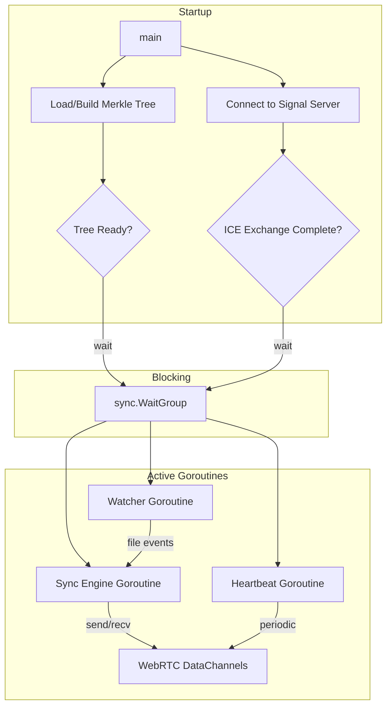

# PSync Daemon

File synchronization daemon for peer-to-peer file sync over WebRTC.

## Lifecycle & Goroutine Flow



### Startup Sequence

1. **Merkle Tree Loader** – Load cached tree from disk OR walk filesystem and compute hashes. Signals `WaitGroup.Done()` when ready.
2. **Signal Server Connector** – WebSocket connect, register, ICE exchange for each peer. Signals ready when at least one peer connected (or timeout).
3. **Main** – Blocks on `WaitGroup.Wait()` until both complete.

### Active Phase

| Goroutine | Responsibility |
|-----------|----------------|
| **Watcher** | FSNotify loop with debounce, pushes events to sync engine |
| **Sync Engine** | Handles incoming peer messages + local file events |
| **Heartbeat** | Periodic pings to peers via data channels |

### Shutdown

- Context cancellation propagates to all goroutines
- Graceful WebRTC close, watcher stop

## Running

```bash
go run ./cmd/daemon -root ~/Documents/Obsidian -signal ws://localhost:8080/ws
```

## Testing

```bash
go test -v ./...
```
